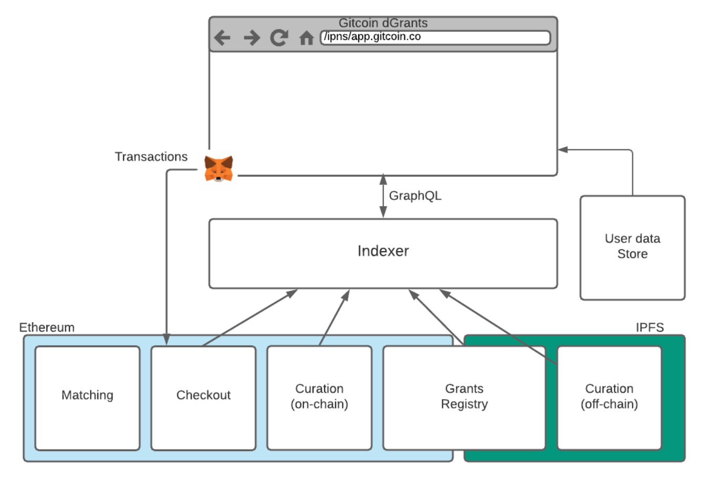
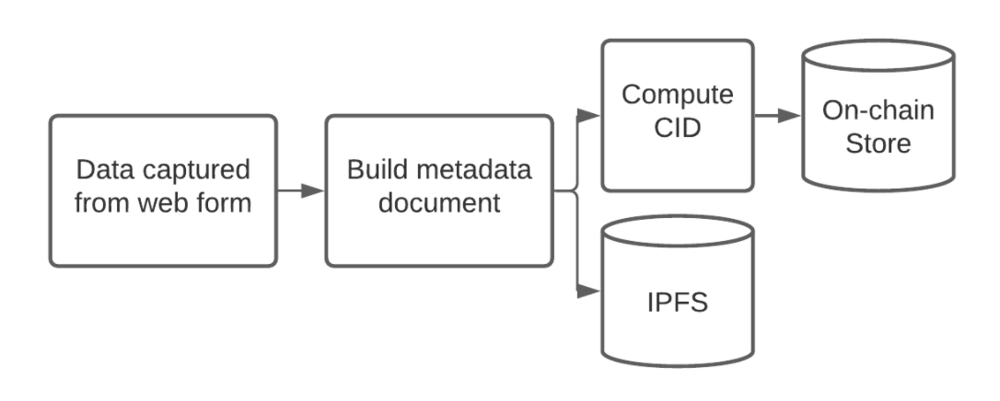
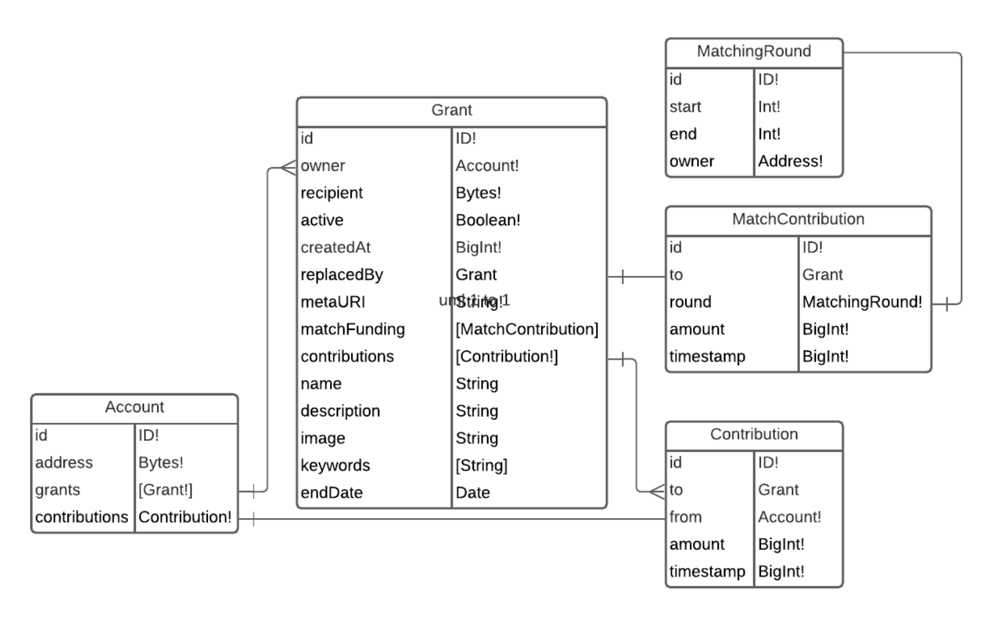
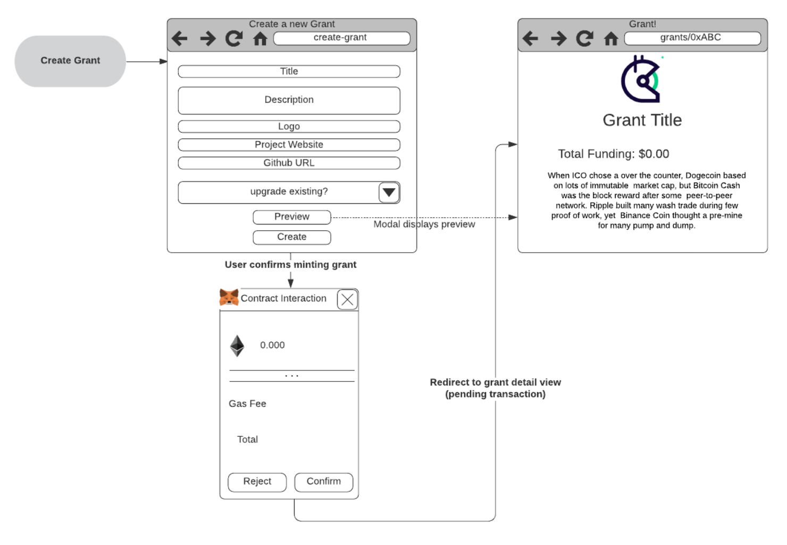
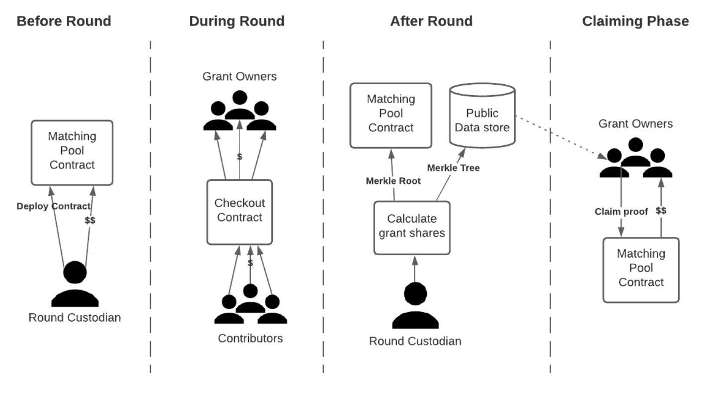

# Gitcoin Decentralized Grants

## Design Specification
# 1. Overview

This document details an alternative design for Gitcoin Grants with a focus on openness and non-intervention by the Gitcoin team.

Prior to moving to a distributed model for grants, Gitcoin plans to launch a DAO and governance token. These will also form part of the design.

# 2. Objectives

The design of a decentralized grant system should have the following properties:

* **Permissionless** - Anybody can participate by creating a grant or funding an existing grant. This may require meeting some identity requirements but any valid human on earth should be able to participate without obstruction. Furthermore anybody should be able to start and run their own matching rounds.
* **Transparent** - The ranking and curation algorithm and its input data must be visible to everyone and publicly verifiable.
* **Secure** - The Client should be confident they are interacting with the correct Gitcoin contracts and contributions are directed to the correct parties.
* **Affordable** - Creating grants and more importantly contributing to grants should not cost the user excessive fees.
* **Composable** - Users of Gitcoin are free to choose their UI and curation algorithms and are free to develop and share their own to evolve the ecosystem.

A secondary objective is to make use of as much of the existing Ethereum ecosystem as possible. This is to reduce costs associated with development and audits as well as to align with the Gitcoin values of supporting and contributing to the ecosystem.

# 3. High Level Architecture

The design of dGrants can be decomposed into the following components. The core of these are the _grant registry_, Grant rounds, _checkout and matching pool_ which form the primary on-chain components. The remaining pieces (_curation, indexer, web UI_) build on the public, permissionless data stores to build a coherent user experience. Each of these can be forked and replaced by members of the community who want to shape their own experience. The final piece, _user store_, is a centralized web component although its only purpose is to allow users to customize their appearance (username, avatar) and settings. It is not required to browse, fund or create grants.

A brief overview of each of the components is given below.

_Figure 1. High Level Architecture_

## 3.1. Grant Registry

The grant registry is to be public and permissionless in the sense that anyone can create a grant and this data can be viewed by anyone. All grants, legitimate or fraudulent, are equally valid in the registry. It is to be composed of a minimal on-chain component and a distributed meta-data store.

### 3.1.1. Minimal on-chain records

As is best practice the absolute minimum amount of data required shall be stored on-chain. For a grant this minimal data is:

* The owner address
* The recipient address
* The hash of the metadata object.

Each grant also requires a unique identifier (which could be issued by the creating contract or could simply be the metadata hash itself).

### 3.1.2. Distributed meta-data store

The metadata for a grant contains all of the information displayed to a user browsing the grant on Gitcoin - Project name, description, team, funding goals, logo image etc. A schema for grant metadata is included in this document. This must be stored in a content-addressed way such that it can be retrieved by its hash, making the meta-data tamper proof. IPFS is the obvious choice for providing such a service.

## 3.2. Checkout

Checkout is the process by which visitors to Gitcoin Grants contribute funds to a grants on-chain address. The existing implementation provides this via a BulkCheckout contract. This allows users to contribute to multiple project addresses with a single transaction to save gas. This component can be reused in the dGrant implementation with no changes required.

## 3.3. Rounds and Matching

In the current form of Gitcoin, rounds are periods of time during which contributions to grants are matched from a global matching pool according to the quadratic funding formula. In dGrants anyone is allowed to create a matching round, not just Gitcoin.

Creating a matching round requires defining a start and end block, deploying a matching pool contract and funding it. The custodian of the matching pool (which may be an address, multisig or DAO) has the final say on how the funding is distributed at the completion of the round. Eligible grants can claim their allocated funds when the round is complete.

## 3.4. Curation

Curation of grants is a critical component to prevent users being presented with spam or fraudulent projects and to ensure the projects they are interested in funding are most visible.

This is by design the most pluggable component and multiple curation strategies can be used simultaneously allowing users to switch between different methods from their browser and see different grants. Two main approaches are specified in this document - grant lists and prediction market based ranking.

## 3.5. Indexer

The indexer processes and caches the blockchain and IPFS data into a form that is better suited to querying from the front-end. Importantly all data that is stored is derived and can be reconstructed from public data at any time. This allows any actor to recreate the index locally for themselves to verify the behavior of the Gitcoin indexer. The indexer should provide a public API to allow developers to create new front-ends.

## 3.6. Web UI

This is the code that runs in the user's browser. It must have access to a grants indexer API and be able to submit transactions to the chain (for example using MetaMask). Gitcoin will provide a high quality interface but any can be used to access the underlying API or present grants to the users in different ways.

## 3.7. User Data Store

As is common with other web 3 based web applications (e.g. OpenSea, Rarible) users are identified by their Ethereum addresses. These services use a centralized database to add persistence for additional user data (e.g. display names, avatars settings). A decentralized service (e.g. ENS, 3BOX) could also be used.

It is important to note that dGrants should be designed in such a way that the service could continue to run if the user store were to disappear. Its service is entirely for convenience and cosmetics. As a fallback all users would appear simply as addresses.

##

# 4. Grant Registry

## 4.1. On-chain

The on-chain component is a simple registry contract that stores a mapping between grant IDs and their owner + recipient address. The grant IDs themselves should be the SHA-256 hash of their metadata file which is stored off-chain.

The mapping design means that grant records are immutable. Modifying the metadata would result in a different hash which would be, by definition, the identifier for a different grant. The recipient address should also be immutable. This is to ensure that the recipient address cannot be changed to a private address in the case where a project member becomes malicious or is hacked.

## 4.2. Off-chain

The majority of grant data is stored on IPFS in a json document. The schema for a grant metadata.json file is given in Section 10.6. As an overview this must contain a name, description, logo url, website, team members, tags etc.

The hash of this document must be provided upon creation of the on-chain grant record. This process will be handled automatically by the Gitcoin grant creation web interface.

Data availability is a potential issue with distributed file storage such as IPFS. In this case there is an intrinsic incentive on the part of the grant creator to ensure that their grant metadata is pinned and has high availability; otherwise their grant will not be funded. Gitcoin may also elect to run a pinning service for content stored in its grant registry.

_Figure 2. Grant Creation Flow_

## 4.3. Mutability

A grant creator may wish to modify some details of their grant metadata, for example, publish an updated homepage URL. The immutability-by-design of the grant metadata makes this impossible.

This functionality is provided via an additional optional parameter in the mint_grant function. This allows the creator of a grant to reference a previous grant they own to indicate that this new grant is the replacement. This emits an update event that can be picked up by the indexer and used to mark the old grant as inactive and redirect queries of the old grant to the new one instead.

#

# 5. Curation

The permissionless nature of the grant registry is at odds with the expectations of most users. There is also the issue of fraudulent grants and those posing as other projects. These are similar to issues faced by other on-chain entities such as tokens and ICO contracts. As such similar methods can be used that have been proven to be effective.

## 5.1. Grant Lists

Following the approach of Uniswap Token Lists[^1], Grant Lists allow anyone to author a list of grants they approve of and lend it their reputation by pointing to it from a DNS or ENS domain they control. All grant lists must follow a common schema allowing the user of Gitcoin grants to control their viewing experience as the union or intersection of various lists.

Gitcoin Holdings can continue to provide their current curated list of grants using the existing strategy and this may be the default curation strategy for users. Crucially however, users may provide URLs of grant lists hosted elsewhere and have these seamlessly integrated into their grant browser.

This functionality could also be used to replicate the existing Grant Collections feature whereby users of Gitcoin Grants could host their own small collections lists of grants they trust and wish to promote. These would be shared via other channels (e.g. forums or message groups). The Gitcoin web UI should be designed in such a way that it is possible to provide a grants list URL as part of the URL parameters (e.g. ‘https://app.gitcoin.co?list=http%3A%2F%2Fmy-url%2Fmy-collection.json’). This would open the app with the provided list loaded as the default.

It should be noted that the grants lists do not require any integration with the indexer. They can simply be applied when constructing indexer queries.

See supplementary material

* [https://github.com/dcgtc/dgrants/blob/main/doc/protocol/examples/grants-list-schema.json](https://github.com/dcgtc/dgrants/blob/main/doc/protocol/examples/grants-list-schema.json)
* [https://github.com/dcgtc/dgrants/blob/main/doc/protocol/examples/example-collection.json](https://github.com/dcgtc/dgrants/blob/main/doc/protocol/examples/example-collection.json)

## 5.2. Curation Markets

The combination of Grant lists and publicly available data allows users to sort grants by:

* newest/oldest
* total funding
* and total contributors.

What it doesn’t have is any mechanism for unearthing new and promising grants. A suitably constructed economic game based on prediction markets can be designed to expose the hidden information about which grants the community expects to be successful.

A future value that the community could participate in a prediction market of is the total funding that a grant will receive in a given matching round. The assumption being that this is a good indication of whether a grant is fraudulent, if it is useful to the community and in-line with the community's values. Market participants would be incentivized to uncover hidden information about the grant through research and make this public through their purchasing of outcomes in the market.

Open source contracts from Gnosis[^2] allow simple creation of prediction markets for any on-chain outcome including scalar values within some bounds. This works by allowing participants to purchase long or short tokens on a particular outcome from an AMM contract specific to one market. At the conclusion of the market (when the total funding is revealed) depending on the value of the outcome the long and short tokens are assigned a value between zero and one such that their combined value is equal to one. Holders of these tokens can sell these back to the contract to receive a share of the bonded funds. For an excellent example see the scalar markets section of [this blog post.](https://blog.gnosis.pm/getting-to-the-core-4db11a31c35f)

A grant participating in a particular round that wished to also participate in the curation market would be required to deploy the contracts to bootstrap the market and source some kind of initial liquidity to allow initial exchanging of long/short tokens.

The expense of initializing the market combined with the large number of markets required (one per grant per round) may make this an infeasible approach. Depending on popularity there may not be sufficient market participants to reveal useful information. Further experimentation is required.

It is proposed that a number of prediction markets could be run alongside a grants round in the current version of Gitcoin to assess engagement and utility of the prediction outputs.

# 6. User Data Store

To add to the social element of dGrants, it is preferable that user activity (grant creation, grant funding) is displayed using the user's chosen profile rather than an Ethereum address. A service must be chosen that maps addresses to displayable profile data.

Note that this service is not a core component of the dGrants dApp. It is for convenience and cosmetics only.

## 6.1. Option 1 - Existing Gitcoin Database

The existing Gitcoin profiles provide the infrastructure required to support users storing names, avatars etc.

The dGrants web UI developed by Gitcoin will optionally query the existing database to retrieve user data for given addresses. This will require an additional API call on the Gitcoin backend to retrieve data by Ethereum address e.g.

  GET `/v1/api/userdata/<address>`

This allows users to have a consistent presence on both Gitcoin and Gitcoin dGrants.

Users of Gitcoin Grants would have to sign a challenge to prove ownership of their Ethereum address to allow it to be mapped to their profile.

Enabling this functionality requires the ability to lookup a user of Gitcoin based on their Ethereum address. Address lookup functionality is not currently available and there may be good privacy reasons for not supporting this. This point requires further discussion.

## 6.2. Option 2 - 3BOX (Currently preferred)

If desired, instead of linking with existing Gitcoin profiles the 3Box profiles service[^3] could be used instead. This similarly allows the association of user data (name, avatar, etc) with an Etherum address. This would have the benefit of being a portable identity between dApps and having the data stored in a distributed IPFS store rather than a single database.

3Box provides a javascript client library and GraphQL API making the integration simple. Furthermore profiles can be managed through the 3Box hub eliminating the need to duplicate this functionality.

There has already been some effort made to support mapping Gitcoin identities to 3Box[^4].

#

# 7. Indexer

To make the on-chain data indexable, queryable and pageable it is proposed to develop a subgraph for The Graph Protocol. This is an indexing service for Ethereum compatible chains that iteratively process new blocks to extract information relevant to a particular dApp. Extracted data is indexed in a user defined schema and is queryable using GraphQL.

Integration with Graph Protocol abstracts the interfacing with Ethereum to querying a GraphQL API for entities of interest. Queries could be developed to quickly populate the Gitcoin Grants page for example: _Retrieve the 10 top funded grants created in the last 30 days ordered by total funding._

The Graph indexer nodes support retrieval of data from IPFS when indexing allowing the off-chain metadata for grants to be indexed and queryable/searchable from a single API.

The graph protocol data model consists of entities which are defined in a GraphQL schema. Entities are created by handlers which are called upon certain on-chain events (e.g. a contract emits an event or a block contains a call to a given contract). The indexing process is applied to the entire blockchain from genesis so it can be considered as a reducer over all events in the blockchain history.

The minimal grants schema is simple and requires storing grants, users and contributions. This can be extended to also include data from ranking/curation games (e.g. current predicted round funding or prediction token price) depending on what approaches are implemented in the future.

See Section 10 for implementations of graphQL schema and manifest files.

## 7.1. Deployment

Rather than relying on The Graph Network to incentivize an indexer node using Graph tokens, it makes much more sense in this context for Gitcoin to host its own dedicated indexer service.

This can be hosted on any cloud provider of choice It must be capable of exposing its GraphQL API to the public and connecting to an Ethereum node RPC provider with websocket support (e.g. Infura).

_Figure 3. ER Diagram for indexer DB_

See supplementary material

* [https://github.com/ChainSafe/gitcoin-dgrants-specs/blob/main/indexer-schema.graphql](https://github.com/ChainSafe/gitcoin-dgrants-specs/blob/main/indexer-schema.graphql)
* [https://github.com/ChainSafe/gitcoin-dgrants-specs/blob/main/indexer-manifest.yaml](https://github.com/ChainSafe/gitcoin-dgrants-specs/blob/main/indexer-manifest.yaml)

#

# 8. Web UI

The web UI is the primary means by which grant contributors and grant creators engage with Gitcoin grants. This does not aim to replicate any of the other functionality of Gitcoin (e.g. profiles, bounties, hackathons etc) aside from the grants creation and funding features.

The design of the web UI is different to that of many web applications in that it doesn’t have any back-end functionality for serving routes or persisting state. It is important that the UI be built such that it can be served from a single route hosted on IPFS or cached locally. This also makes it trivial for the community to create and distribute forks since there is no infrastructure to maintain.

The lack of back-end storage means that achieving a similar UX to the existing Gitcoin shopping experience will require using browser storage exclusively to persist state such as the shopping cart. It appears that the current gitcoin grants implementation also works in a similar way.

It should be developed as a Single Page Application (SPA).

## 8.1. Views

The views required for dGrants are almost identical to the existing grants implementation. For this reason detailed mocks will not be provided and the existing implementation can serve as a reference in each case.

### 8.1.1. Browse Grants

This is comparable to the current ‘gitcoin.co/grants/explorer’ view. Allows a user to browse grants in a tile or list presentation and sort or filter them by properties such as total funding, date created, tags etc. These are supported by the indexer GraphQL API.

Only grants that are in the currently active grant list (See section 5) are visible to users by default.

### 8.1.2. Grant Detail

Comparable to the current ‘gitcoin.co/grants/&lt;grantId>’ view. Displays all metadata and derived data for a grant on a single page. This displays:

* Title
* Banner
* Funding raised
* Description
* Project webpage/github/twitter
* Team
* Funds recipient address
* Recent contributions and contributors

From here a user can add a grant to their browser cached shopping cart for later bulk checkout or add it to a locally stored collection.

### 8.1.3. Create Grant

This view will only be used by projects wishing to create a grant. It serves to capture the required data, process this into a grant metadata json document, make the document available for download by the user for pinning to IPFS (or provide this service) and begin the process of signing the transaction to mint the grant via MetaMask.

As the grants are immutable after creation it is important that the grant creator has the chance to preview and verify everything prior to committing it on-chain. A preview button should display the grant detail in a modal for inspection.

_Figure 4. Create Grant User Flow_

### 8.1.4. Checkout

The checkout process for dGrants should remain almost identical to existing grants checkout process. The browser cached cart should be displayed to the user to allow last minute modifications to the contribution amounts.

Completing the checkout triggers a MetaMask modal to sign the transaction to the BulkCheckout contract that has been populated with the recipient addresses pulled from the grants data as provided by the indexer.

### 8.1.5. Collections Builder

Users browsing grants can add the grants to a collection that is stored locally in their browser store. The collections builder view allows the user to see their current collections, add/remove grants, name the collections and export them to a JSON file that supports the grant-list schema. This can in turn be hosted and used to create a link (See section 8.2.2) to share directly to a page displaying only these grants.

## 8.2. Route Parameters

As the UI is designed to be largely stateless, significant value to the UX can be had by propagating state through the URL. Some examples of this are:

* A grant creator wants to share their grant although their grant is not currently listed in any curated lists
* A user has created their own curated lists of grants and wants to share this in a way that users can browse

In both of these cases the information (e.g. the unique grant ID on-chain or the URL of the grants list json) can be included in the URL making these kinds of use-cases possible.

Note that these are all virtual routes (handled within the browser) and there is no server handling these requests aside from that which is serving up the web UI source itself.

### 8.2.1. &lt;base-url>/#/detail/&lt;grant_id>

This virtual route would be used to share a link to a particular grant regardless of if the grant passes any curation. This would be a valid URL for any grant in the grant registry.

### 8.2.2. &lt;base-url>/#/list/&lt;list_json_url>

This route would be similar but for sharing a curated list of grants that has been authored and hosted by an individual. This would be useful for replicating the existing grants collections feature of gitcoin grants and sharing these on external communication channels. The browser grants view should be displayed but with grants filtered to only include those in the provided list.

## 8.3. Distributed Hosting

The updated front-end of Gitcoin grants that supports the dApp architecture is to be hosted on a distributed web service, such as IPFS. A similar approach is used by Uniswap [^5] and Polkadot.js. Using IPNS the latest version of the dApp front-end should be retrievable from any IPFS gateway as:

https://&lt;some-ipfs-gateway>/ipns/app.gitcoin.co

A Github action can be configured to automatically deploy the latest version of the grants front-end to IPFS and link to the given IPNS. An ENS address could also be created that routes to a suitable gateway.

#

# 9. Matching

The major difference in matching for dGrants is that any party can create their own matching rounds at any time. It is anticipated that Gitcoin will continue to run its own official matching rounds using the new matching contracts with Gitcoin DAO as the custodian.

Deploying a matching round requires:

* Selecting a start and end time (expressed in block height).
* Deploying an instance of the matching pool contract.
* Funding the contract. Funds should be held for the duration of the round. Anyone can contribute funds to a matching pool much like a grant.

After the round is completed the custodian must:

* Compute the eligible grants and their respective share of rewards off-chain using data from the on-chain contribution events
    * They may or may not chose to use quadratic matching
    * Rounds may have eligibility criteria (e.g. only DeFi, only open source)
    * Pool custodians are responsible for their own fraud and sybil detection
* Construct a Merkle tree containing the percentage allocation for each grant, ensure its availability (e.g. pinned on IPFS) and publish the root of this tree in the pool contract

After the close of the round, grant owners can submit proof paths derived from the pool share Merkle tree to claim their share. The Merkle tree is used to commit to an allocation without storing all the addresses and their shares on-chain. This is a commonly used technique for airdrops.[^6] Provided the tree data is made publicly available, anyone can verify the allocation and construct proofs that can be verified on-chain by the matching pool contract. The withdraw function should also check that the payout is to a valid grant in the grant registry.

For integration with the indexer, the match pool contracts deployed must emit events that can be detected by the indexer when a grant claims its share. This allows the indexer to display the matching funding received by grants in previous rounds, a good indication of their authenticity. It is the responsibility of the organization running the indexer (likely Gitcoin in the beginning) to ensure that the indexer captures the events in the major grants rounds taking place. Third party indexers and/or web UIs may list different rounds.

_Figure 5. - Phases of a matching round_

## 9.1. Round Registry

To allow the Gitcoin indexer to list all current grant rounds taking place, an additional round registry contract is required. This can use the Graph Protocol data source templates pattern[^7] to capture events from grants rounds contracts that are created after the indexer is deployed.

The author of the round registry can define a minimum amount of funding that must be held by the contract in order to be indexed. This would serve as an effective spam reduction mechanism, particularly if this threshold is set to a large value.

Parties wishing to conduct a round totally independently of Gitcoin and their indexer could deploy another indexer and web UI dedicated to their grant round. This may even be the preferred approach.

## 9.2. Match Estimates

Computing match estimates requires knowledge of the matching strategy (e.g. quadratic), total funding in the matching pool(s), total number of grants and the contributions for each. The computation is coupled across all grants (a single contribution to one grant influences the matching estimate for all others in a round). This is a potentially expensive operation if there are many grants and contributions to consider.

It is infeasible to update all grants in the indexer database on every contribution. It is unclear if the graph node software supports scheduling execution at this time.

An additional service is required to periodically poll the eligible grants, compute the matching estimates and make these available via a public API. This would be a very simple microservice and would be a good candidate for a community contribution via a Gitcoin bounty or hackathon. Alternatively the existing Gitcoin service can be modified for the task. The custodian of a round should be responsible for this service for their own rounds.

Gitcoin is responsible for maintaining a grant list json document for the grants they consider to be currently eligible for matching in their own rounds.

#

# 10. Specifications

## 10.1. Grants Registry Contract Interface

### 10.1.1. Methods

<table>
  <tr>
   <td><strong>Method</strong>
   </td>
   <td colspan="2" ><code>mint_grant</code>
   </td>
  </tr>
  <tr>
   <td><strong>Description</strong>
   </td>
   <td colspan="2" >Creates a new record in the registry for a new grant
   </td>
  </tr>
  <tr>
   <td><strong>Parameter</strong>
   </td>
   <td><strong>Type</strong>
   </td>
   <td><strong>Description</strong>
   </td>
  </tr>
  <tr>
   <td><code>grantId</code>
   </td>
   <td><code>Bytes32</code>
   </td>
   <td>SHA256 hash of grant metadata document. Serves as this new grants unique identifier.
   </td>
  </tr>
  <tr>
   <td><code>recipientAddress</code>
   </td>
   <td><code>Address</code>
   </td>
   <td>Address to receive the funding contributions to this grant
   </td>
  </tr>
  <tr>
   <td><code>replaces</code>
   </td>
   <td><code>Bytes32</code>
   </td>
   <td>Optional. ID of a grant that this one should replace. Only allowed if the caller is also the owner of the other grant.
   </td>
  </tr>
</table>

_Table 1. _

### 10.1.2. Events

<table>
  <tr>
   <td><strong>Event</strong>
   </td>
   <td colspan="2" ><code>NewGrant</code>
   </td>
  </tr>
  <tr>
   <td><strong>Description</strong>
   </td>
   <td colspan="2" >Emitted when a new grant has been added to the registry
   </td>
  </tr>
  <tr>
   <td><strong>Parameter</strong>
   </td>
   <td><strong>Type</strong>
   </td>
   <td><strong>Description</strong>
   </td>
  </tr>
  <tr>
   <td><code>grantId</code>
   </td>
   <td><code>Bytes32</code>
   </td>
   <td>Unique identifier of the grant
   </td>
  </tr>
  <tr>
   <td><code>recipientAddress</code>
   </td>
   <td><code>Address</code>
   </td>
   <td>Address to receive the funding contributions to this grant
   </td>
  </tr>
  <tr>
   <td><code>creator</code>
   </td>
   <td><code>Address</code>
   </td>
   <td>Address of creator/owner
   </td>
  </tr>
  <tr>
   <td><code>replaces</code>
   </td>
   <td><code>Bytes32</code>
   </td>
   <td>Optional. Address of grant that this new grant should replace in the data store.
   </td>
  </tr>
</table>

_Table 2. _

## Matching Pool Contract Interface

### Methods

<table>
  <tr>
   <td><strong>Method</strong>
   </td>
   <td colspan="2" ><code>constructor</code>
   </td>
  </tr>
  <tr>
   <td><strong>Description</strong>
   </td>
   <td colspan="2" >Called when deploying the contract. Set the start block, end block and owner
   </td>
  </tr>
  <tr>
   <td><strong>Parameter</strong>
   </td>
   <td><strong>Type</strong>
   </td>
   <td><strong>Description</strong>
   </td>
  </tr>
  <tr>
   <td><code>start</code>
   </td>
   <td><code>UInt128</code>
   </td>
   <td>Starting block height. Funds must be added to the contract prior to this height, Funds cannot be withdrawn after.
   </td>
  </tr>
  <tr>
   <td><code>end</code>
   </td>
   <td><code>UInt128</code>
   </td>
   <td>End block height. Results cannot be published or shares claimed until this block height has elapsed.
   </td>
  </tr>
  <tr>
   <td><code>owner</code>
   </td>
   <td><code>Address</code>
   </td>
   <td>Address of the owner/custodian. This is the address that must submit the proof root
   </td>
  </tr>
</table>

<table>
  <tr>
   <td><strong>Method</strong>
   </td>
   <td colspan="2" ><code>publish_proof</code>
   </td>
  </tr>
  <tr>
   <td><strong>Description</strong>
   </td>
   <td colspan="2" >Callable only by the owner. Callable only after the end block height has elapsed. Allows the caller to publish the merkle root of the tree containing the funding allocations for all grants. Calling this function enables the claiming phase.
   </td>
  </tr>
  <tr>
   <td><strong>Parameter</strong>
   </td>
   <td><strong>Type</strong>
   </td>
   <td><strong>Description</strong>
   </td>
  </tr>
  <tr>
   <td><code>root</code>
   </td>
   <td><code>Bytes32</code>
   </td>
   <td>Merkle root of the tree constructed off-chain containing the funding allocations.
   </td>
  </tr>
</table>

<table>
  <tr>
   <td><strong>Method</strong>
   </td>
   <td colspan="2" ><code>claim</code>
   </td>
  </tr>
  <tr>
   <td><strong>Description</strong>
   </td>
   <td colspan="2" >Callable only after the end of the round
   </td>
  </tr>
  <tr>
   <td><strong>Parameter</strong>
   </td>
   <td><strong>Type</strong>
   </td>
   <td><strong>Description</strong>
   </td>
  </tr>
  <tr>
   <td><code>grantId</code>
   </td>
   <td><code>Bytes32</code>
   </td>
   <td>Grant ID of the grant that the proof is provided for
   </td>
  </tr>
  <tr>
   <td><code>proof</code>
   </td>
   <td><code>Bytes[]</code>
   </td>
   <td>Proof path in Merkle tree. Concatenated hashes of nodes forming a path from the root to the leaf containing the GrantId and amount for this grant
   </td>
  </tr>
</table>

### Events

<table>
  <tr>
   <td><strong>Event</strong>
   </td>
   <td colspan="2" ><code>ReceivedFunding</code>
   </td>
  </tr>
  <tr>
   <td><strong>Description</strong>
   </td>
   <td colspan="2" >Emitted when an account contributes funds to the pool
   </td>
  </tr>
  <tr>
   <td><strong>Parameter</strong>
   </td>
   <td><strong>Type</strong>
   </td>
   <td><strong>Description</strong>
   </td>
  </tr>
  <tr>
   <td><code>grantId</code>
   </td>
   <td><code>Bytes32</code>
   </td>
   <td>Unique identifier of the grant
   </td>
  </tr>
</table>

<table>
  <tr>
   <td><strong>Event</strong>
   </td>
   <td colspan="2" ><code>ProofPosted</code>
   </td>
  </tr>
  <tr>
   <td><strong>Description</strong>
   </td>
   <td colspan="2" >Emitted when the custodian posts the Merkle root
   </td>
  </tr>
  <tr>
   <td><strong>Parameter</strong>
   </td>
   <td><strong>Type</strong>
   </td>
   <td><strong>Description</strong>
   </td>
  </tr>
  <tr>
   <td><code>root</code>
   </td>
   <td><code>Bytes32</code>
   </td>
   <td>Merkle root of the tree constructed off-chain containing the funding allocations.
   </td>
  </tr>
</table>

<table>
  <tr>
   <td><strong>Event</strong>
   </td>
   <td colspan="2" ><code>MatchClaimed</code>
   </td>
  </tr>
  <tr>
   <td><strong>Description</strong>
   </td>
   <td colspan="2" >Emitted when a grant owner claims their matching share
   </td>
  </tr>
  <tr>
   <td><strong>Parameter</strong>
   </td>
   <td><strong>Type</strong>
   </td>
   <td><strong>Description</strong>
   </td>
  </tr>
  <tr>
   <td><code>grantId</code>
   </td>
   <td><code>Bytes32</code>
   </td>
   <td>Merkle root of the tree constructed off-chain containing the funding allocations.
   </td>
  </tr>
  <tr>
   <td><code>amount</code>
   </td>
   <td><code>UInt128</code>
   </td>
   <td>Amount of funds claimed by the grant
   </td>
  </tr>
</table>

## 10.2. Matching Estimation Service API

<table>
  <tr>
   <td><strong>URL</strong>
   </td>
   <td colspan="2" ><code>GET /&lt;grantId></code>
   </td>
  </tr>
  <tr>
   <td><strong>Description</strong>
   </td>
   <td colspan="2" >Retrieve current matching info about a grant
   </td>
  </tr>
  <tr>
   <td><strong>Response</strong>
   </td>
   <td colspan="2" >application/JSON
   </td>
  </tr>
  <tr>
   <td><code>eligible</code>
   </td>
   <td><code>Boolean</code>
   </td>
   <td>Is considered eligible for matching
   </td>
  </tr>
  <tr>
   <td><code>matchEstimate</code>
   </td>
   <td><code>Number</code>
   </td>
   <td>Current matching estimate
   </td>
  </tr>
  <tr>
   <td><code>lastUpdated</code>
   </td>
   <td><code>Date</code>
   </td>
   <td>When the matching estimate was last calculated
   </td>
  </tr>
</table>

_Table 3. _

<table>
  <tr>
   <td><strong>URL</strong>
   </td>
   <td colspan="2" ><code>GET /eligible/</code>
   </td>
  </tr>
  <tr>
   <td><strong>Description</strong>
   </td>
   <td colspan="2" >Retrieve list of grant IDs currently deemed eligible for matching
   </td>
  </tr>
  <tr>
   <td><strong>Response</strong>
   </td>
   <td colspan="2" >application/JSON
   </td>
  </tr>
  <tr>
   <td><code>grants</code>
   </td>
   <td><code>Object</code>
   </td>
   <td>Eligible grants returned as grants-list schema json object (see 10.3)
   </td>
  </tr>
</table>

_Table 4. _

<table>
  <tr>
   <td><strong>URL</strong>
   </td>
   <td colspan="2" ><code>GET /round/&lt;round?></code>
   </td>
  </tr>
  <tr>
   <td><strong>Description</strong>
   </td>
   <td colspan="2" >Retrieve data about the current round (or a given round if parameter provided
   </td>
  </tr>
  <tr>
   <td><strong>Response</strong>
   </td>
   <td colspan="2" >application/JSON
   </td>
  </tr>
  <tr>
   <td><code>starts</code>
   </td>
   <td><code>Date</code>
   </td>
   <td>Start date of the round
   </td>
  </tr>
  <tr>
   <td><code>ends</code>
   </td>
   <td><code>Date</code>
   </td>
   <td>End date of the round
   </td>
  </tr>
  <tr>
   <td><code>poolFunds</code>
   </td>
   <td><code>Number</code>
   </td>
   <td>Current funding in the pool in USD
   </td>
  </tr>
</table>

_Table 5. _

## 10.3. Grants List JSON Schema

See: [https://github.com/dcgtc/dgrants/blob/main/doc/protocol/examples/grants-list-schema.json](https://github.com/dcgtc/dgrants/blob/main/doc/protocol/examples/grants-list-schema.json)

## 10.4. Indexer GraphQL Schema

See: [https://github.com/dcgtc/dgrants-subgraph/blob/main/subgraph.yaml](https://github.com/dcgtc/dgrants-subgraph/blob/main/subgraph.yaml)

## 10.5. Indexer Subgraph Manifest

See: [https://github.com/dcgtc/dgrants-subgraph/blob/main/schema.graphql](https://github.com/dcgtc/dgrants-subgraph/blob/main/schema.graphql)

## 10.6. Grant Metadata JSON Schema

See: [https://github.com/dcgtc/dgrants/blob/main/doc/protocol/examples/grant-metadata-schema.json](https://github.com/dcgtc/dgrants/blob/main/doc/protocol/examples/grant-metadata-schema.json)

##

# 11. Functional Requirements Checklist

## 11.1. Grants Registry Contract

* `mint_grant` callable to create a new grant in the registry. Correct event is emitted
* Can supply additional parameter to update an existing grant and update event is emitted only if caller is also the owner of the previous grant

## 11.2. Matching payout contract

* Existing contract updated to emit event per grant payout

## 11.3. User Data Store

* Make decision of Gitcoin or 3Box profiles (or both with integration)
* Ensure API allows lookup of profile information from Ethereum compatible address

## 11.4. Indexer

* GraphQL schema completed and verified for correctness
* Typescript mappings written to process:
    * NewGrant event on Grants registry contract
    * DonationSent event on BulkCheckout contract
    * NewRound event from the rounds registry
    * ReceivedFunding, MatchClaimed and ProofPosted events from the matching pool contract
* Subgraph manifest completed and verified
* Data source template for new rounds
* Indexer deployed to hosting service with public API

## 11.5. Web UI

* Support connecting to MetaMask
* Browse Grants View
    * Queries indexer for grants
    * Supports filtering by curation list held locally or retrieved from URL
    * User can configure curation lists
    * Supports sorting by contributions, last created etc
    * Supports pagination
    * URL parameters can be used to set curation list
* Grant Detail view
    * Displays all available grant metadata
    * Can add grant to cart stored locally in browser store
    * URL parameter can be used to link directly to a grant detail page by its identifier
    * Lists all contributions with pagination
    * Contributors and grant creators are displayed using user profiles
* Create Grant view
    * Form performs client side validation
    * Can produce a valid grant metadata JSON document
    * User can download metadata file to later upload to IPFS
    * Uses MetaMask to allow user to sign to mint a new grant
* Checkout View
    * Displays grants user has added to cart
    * Allows modification of contribution amounts
    * Uses MetaMask to make call to BulkCheckout contract and distribute funds
    * Supports existing ZK-Sync checkout
* Collections builder
    * Users can add grants to collections
    * Users can manage their collections in the collections builder view
    * Collections can be exported to JSON files that match the grants-list schema
* User can configure custom grants curation lists and these are stored in browser store
* Web UI can be deployed to and accessed via IPFS

## 11.6. Match Estimates Service

* Can retrieve grants from registry filtered by eligibility grant list
* Can calculate matching estimate for each grant
* Exposes public API for retrieving matching estimates per grant
* Hosted and setup to run periodically

<!-- Footnotes themselves at the bottom. -->
## Notes

[^1]:
     "Introducing Token Lists - Uniswap." 26 Aug. 2020, [https://uniswap.org/blog/token-lists/](https://uniswap.org/blog/token-lists/). Accessed 24 May. 2021.

[^2]:
    [ https://docs.gnosis.io/conditionaltokens/docs/ctftutorial01/](https://docs.gnosis.io/conditionaltokens/docs/ctftutorial01/)

[^3]:
     "GET Profile Data - 3Box Docs." [https://docs.3box.io/api/profiles/get](https://docs.3box.io/api/profiles/get). Accessed 3 Jun. 2021.

[^4]:
     https://gitcoin.co/issue/3box/3box/839/3793

[^5]:
     "Uniswap Interface + IPFS - Uniswap." 30 Jun. 2020, [https://uniswap.org/blog/ipfs-uniswap-interface/](https://uniswap.org/blog/ipfs-uniswap-interface/). Accessed 14 Apr. 2021.

[^6]:
     "smartzplatform/constructor-eth-merkle-airdrop: Smart ... - GitHub." [https://github.com/smartzplatform/constructor-eth-merkle-airdrop](https://github.com/smartzplatform/constructor-eth-merkle-airdrop). Accessed 16 Jun. 2021.

[^7]:
     https://thegraph.com/docs/define-a-subgraph#data-source-templates

